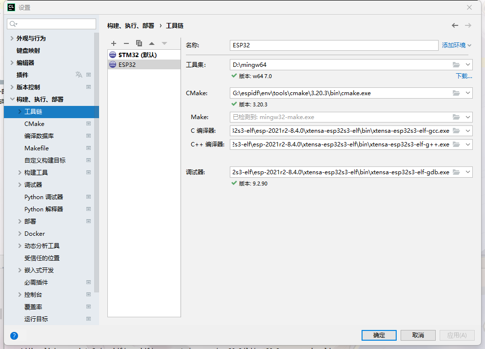
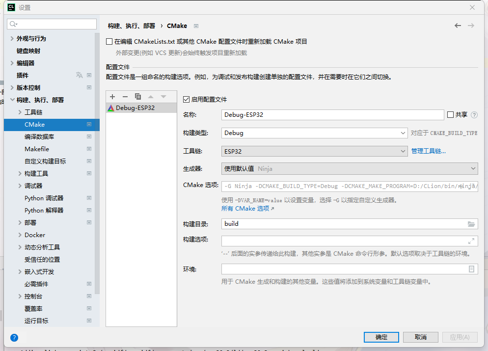
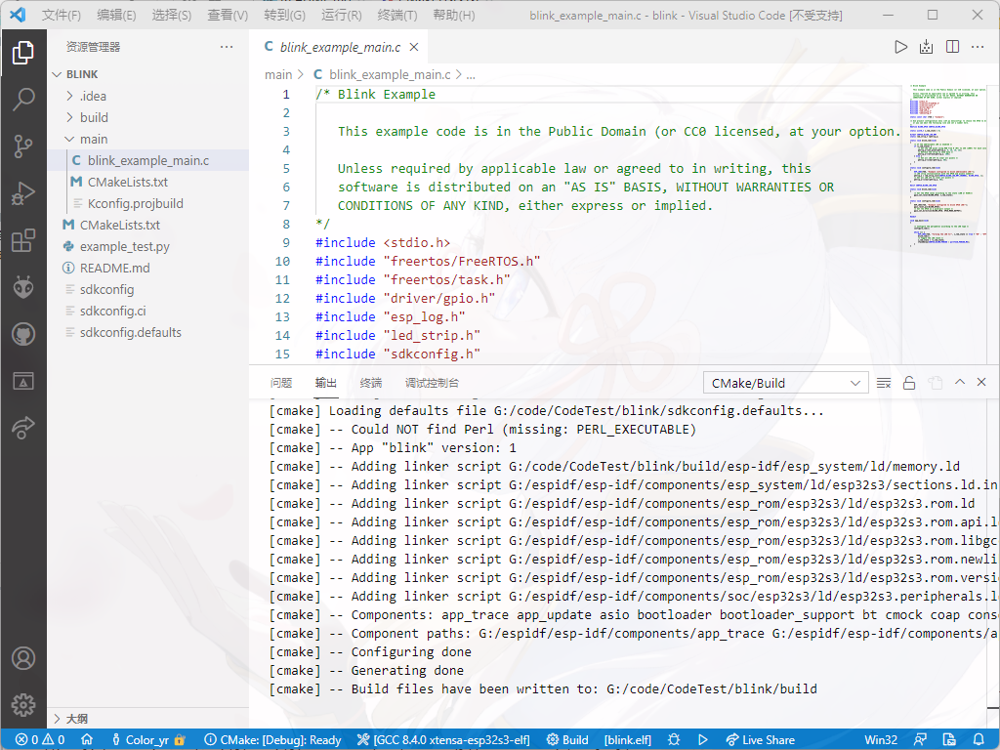

# 例程编译
操作前请确保你已经安装了`ESP-IDF`

[返回](/README.md)

## 复制官方例程

在`ESP-IDF克隆的目录\examples\get-started`下，随便选择一个例程复制到一个地方

例如我选的是`blink`

复制`blink`文件夹到其他地方

修改CMakeList.txt
```
# The following five lines of boilerplate have to be in your project's
# CMakeLists in this exact order for cmake to work correctly
cmake_minimum_required(VERSION 3.5)

set(EXTRA_COMPONENT_DIRS $ENV{IDF_PATH}/examples/common_components/led_strip)

set(IDF_TARGET esp32s3)

include($ENV{IDF_PATH}/tools/cmake/project.cmake)
project(blink)

```

使用命令行编译
在`blink`目录打开命令行
```
idf.py build
```

## 使用IDE编写代码
使用前需要安装工具联，具体教程网上有

- Clion编译  
使用Clion打开`blink`目录  
设置工具链  
C编译器：`你想让esp-idf工具安装的目录\tools\xtensa-esp32s3-elf\esp-2021r2-8.4.0\xtensa-esp32s3-elf\bin\xtensa-esp32s3-elf-gcc.exe`  
C++编译器：`你想让esp-idf工具安装的目录\tools\xtensa-esp32s3-elf\esp-2021r2-8.4.0\xtensa-esp32s3-elf\bin\xtensa-esp32s3-elf-g++.exe`  
调试器：`你想让esp-idf工具安装的目录\tools\xtensa-esp32s3-elf\esp-2021r2-8.4.0\xtensa-esp32s3-elf\bin\xtensa-esp32s3-elf-gdb.exe`  
CMake：`你想让esp-idf工具安装的目录\cmake\3.20.3\bin\cmake.exe`
设置CMake  
构建目录：`build`  
其他不用动
  


- Vscode
使用Vscode打开`blink`目录  
安装`CMake`扩展  
选择`GCC 8.4.0 xtensa-esp32s3-elf`  
最下方的`[all]`点开，选择`blink.elf`  


## 注意事项
编译只能用
```
idf.py build
```
不能使用IDE的构建